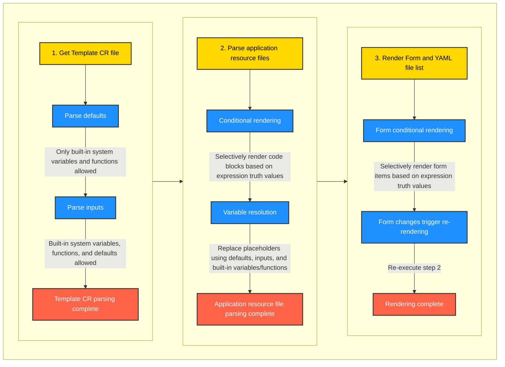

# Template Guide


Using FastGPT as an example, this guide explains how to create a template with code. This example assumes you already have some understanding of Kubernetes resource files and only explains parameters specific to templates. The template file is mainly divided into two parts.


## Part 1: `Metadata CR`

```yaml
apiVersion: app.sealos.io/v1
kind: Template
metadata:
  name: fastgpt
spec:
  title: 'FastGpt'
  url: 'https://fastgpt.run/'
  gitRepo: 'https://github.com/labring/FastGPT'
  author: 'sealos'
  description: 'Fast GPT allows you to use your own openai API KEY to quickly call the openai interface, currently integrating Gpt35, Gpt4 and embedding. You can build your own knowledge base.'
  readme: 'https://raw.githubusercontent.com/labring-actions/templates/kb-0.9/template/fastgpt/README.md'
  icon: 'https://avatars.githubusercontent.com/u/50446880?s=96&v=4'
  templateType: inline
  defaults:
    app_name:
      type: string
      value: fastgpt-${{ random(8) }}
    app_host:
      type: string
      value: ${{ random(8) }}
  inputs:
    root_passowrd:
      description: 'Set root password. login: username: root, password: root_passowrd'
      type: string
      default: ${{ SEALOS_NAMESPACE }}
      required: true
    openai_key:
      description: 'openai api key'
      type: string
      default: ''
      required: true
    database_type:
      description: 'type of database'
      required: false
      type: choice
      default: 'mysql'
      options:
        - sqlite
        - mysql
```

As shown in the code, the Metadata CR is a standard Kubernetes custom resource type. The table below lists the fields that need to be filled in.

| Field            | Description                                                         |
| :---------------| :----------------------------------------------------------- |
| `templateType` | `inline` indicates this is an inline template where all yaml files are integrated into a single file. |
| `defaults`      | Defines default values to be populated into the resource files, such as the application name (app_name), domain (app_host), etc. |
| `inputs`        | Defines some parameters that users need when deploying the application, such as email, API-KEY, etc. If there are none, this can be omitted. |

### Explanation: `Variables`

Any characters surrounded by `${{ }}` are variables. Variables are divided into the following types:

1. `SEALOS_` all-uppercase predefined system built-in variables, such as `${{ SEALOS_NAMESPACE }}`, are variables provided by Sealos itself. For all currently supported system variables, see [System Variables](#built-in-system-variables-and-functions).
2. `functions()` functions, such as `${{ random(8) }}`, are functions provided by Sealos itself. For all currently supported functions, see [Functions](#built-in-system-variables-and-functions).
3. `defaults` is a list of names and values that are resolved when populating random values.
4. `inputs` are filled in by the user when deploying the application, and the inputs will be rendered as a frontend form.

### Explanation: `Defaults`

`spec.defaults` is a mapping of names, types, and values that are populated as default values when the template is parsed.

| Name    | Description |
| :-------| :---------- |
| `type`  | `string` or `number` indicates the type of the variable. The only difference is that string types will be quoted during rendering, while number types will not. |
| `value` | The value of the variable. If the value is a function, it will be rendered. |

**In the current version implementation, `defaults` must have an `app_name` field, and it must contain a `${{ random(8) }}` random number as the unique name for the application, otherwise an error will occur.**

### Explanation: `Inputs`

`spec.defaults` is a defined object mapping that is parsed and displayed as form inputs for user interaction.

| Name    | Description |
| :-------| :---------- |
| `description` | The description of the input. It will be rendered as the input placeholder. |
| `default`     | The default value of the input. |
| `required`    | Whether the input is required. |
| `type`        | Must be one of `string` \| `number` \| `choice` \| `boolean` |
| `options`?    | When the type is `choice`, sets the list of available options. |
| `if`?         | A JavaScript expression that controls whether this option is enabled. |

The inputs shown above will be rendered as form inputs on the frontend:

<table>
<tr>
<td> Template </td> <td> View </td>
</tr>
<tr>
<td width="50%">

```yaml
inputs:
  root_passowrd:
    description: 'Set root password. login: username: root, password: root_passowrd'
    type: string
    default: ''
    required: true
  openai_key:
    description: 'openai api key'
    type: string
    default: ''
    required: true
```

</td>
<td>


</td>
</tr>
</table>

#### Usage of the `if` Parameter in `Inputs`

- The form supports dynamic rendering, controlling whether a form item is enabled through the `if` parameter.
- The content of the parameter is an expression; do not wrap it with `${{ }}`.
- When the expression result is `true`, the parameter is rendered; when the result is `false`, the parameter is not rendered, and the corresponding `required` parameter will not take effect either.
- If the result is not a boolean value, it will be coerced to a boolean value.

### Built-in System Variables and Functions

The Sealos template engine uses the `${{ expression }}` syntax to parse expressions.

- `expression` is a valid JavaScript expression.
- Built-in Sealos variables and functions can be accessed within the expression.

Sealos provides some built-in system variables and functions for convenient use in templates.

#### Built-in System Variables

- `${{ SEALOS_NAMESPACE }}` The namespace where the Sealos user deploys.
- `${{ SEALOS_CLOUD_DOMAIN }}` The domain suffix of the Sealos cluster.
- `${{ SEALOS_CERT_SECRET_NAME }}` The secret name used by Sealos to store TLS certificates.
- `${{ SEALOS_SERVICE_ACCOUNT }}` The SA of the Sealos user.

#### Built-in System Functions

- `${{ random(length) }}` Generates a random string of the specified `length`.
- `${{ base64(expression) }}` Encodes the expression result into base64 format.
  - `${{ base64('hello world') }}` will return `aGVsbG8gd29ybGQ=`.
  - You can also reference variables `${{ base64(inputs.secret) }}`.

> Note
>
> You cannot use `${{ inputs.enabled }}` to determine whether an option is enabled, because `enabled` is a string, not a boolean value.
>
> You need to use `${{ inputs.enabled === 'true' }}` to determine whether an option is enabled.

#### Conditional Rendering

The Sealos template engine supports conditional rendering using `${{ if(expression) }}`, `${{ elif(expression) }}`, `${{ else() }}`, and `${{ endif() }}`.

- Conditional rendering is a special type of built-in system function.
- Conditional statements must occupy a line by themselves and cannot be on the same line as other content.
- Conditional expressions must return a boolean value (`true` or `false`); otherwise, they will be coerced to a boolean value.
- Cross-YAML-list rendering is allowed.
- `Template CR` does not support conditional rendering.

**Example:**

```yaml
${{ if(inputs.enableIngress === 'true') }}
apiVersion: networking.k8s.io/v1
kind: Ingress
...
${{ endif() }}
```

This code means that the Ingress resource will only be rendered when `inputs.enableIngress` is `true`.

<details>

<summary>A relatively complete example</summary>

```yaml
apiVersion: app.sealos.io/v1
kind: Template
metadata:
  name: chatgpt-next-web
spec:
  title: 'chatgpt-next-web'
  url: 'https://github.com/Yidadaa/ChatGPT-Next-Web'
  gitRepo: 'https://github.com/Yidadaa/ChatGPT-Next-Web'
  author: 'Sealos'
  description: 'One-click free deployment of your cross-platform private ChatGPT application'
  readme: 'https://raw.githubusercontent.com/labring-actions/templates/kb-0.9/template/chatgpt-next-web/README.md'
  icon: 'https://raw.githubusercontent.com/Yidadaa/ChatGPT-Next-Web/main/docs/images/icon.svg'
  templateType: inline
  categories:
    - ai
  defaults:
    app_host:
      type: string
      value: ${{ random(8) }}
    app_name:
      type: string
      value: chatgpt-next-web-${{ random(8) }}
  inputs:
    DOMAIN:
      description: "Custom domain, need to CNAME to: ${{ defaults.app_host + '.' + SEALOS_CLOUD_DOMAIN }}"
      type: string
      default: ''
      required: false
    OPENAI_API_KEY:
      description: 'This is your API key obtained from the OpenAI account page. Separate multiple keys with commas to enable random rotation among these keys'
      type: string
      default: ''
      required: true
    HIDE_USER_API_KEY:
      description: 'Check this if you do not want users to fill in their own API Key'
      type: boolean
      default: 'false'
      required: false
    AUZRE_ENABLE:
      description: 'Enable Azure'
      type: boolean
      default: 'false'
      required: false
    AZURE_API_KEY:
      description: 'Azure Key'
      type: string
      default: ''
      required: true
      if: inputs.AUZRE_ENABLE === 'true'
    AZURE_URL:
      description: 'Azure Deployment URL'
      type: string
      default: 'https://{azure-resource-url}/openai/deployments/{deploy-name}'
      required: true
      if: inputs.AUZRE_ENABLE === 'true'

---
apiVersion: apps/v1
kind: Deployment
metadata:
  name: ${{ defaults.app_name }}
  annotations:
    originImageName: yidadaa/chatgpt-next-web:v2.12.4
  labels:
    cloud.sealos.io/app-deploy-manager: ${{ defaults.app_name }}
    app: ${{ defaults.app_name }}
spec:
  replicas: 1
  revisionHistoryLimit: 1
  selector:
    matchLabels:
      app: ${{ defaults.app_name }}
  template:
    metadata:
      labels:
        app: ${{ defaults.app_name }}
    spec:
      automountServiceAccountToken: false
      containers:
        - name: ${{ defaults.app_name }}
          image: yidadaa/chatgpt-next-web:v2.12.4
          env:
            - name: OPENAI_API_KEY
              value: ${{ inputs.OPENAI_API_KEY }}
            ${{ if(inputs.HIDE_USER_API_KEY === 'true') }}
            - name: HIDE_USER_API_KEY
              value: '1'
            ${{ endif() }}
            ${{ if(inputs.AUZRE_ENABLE === 'true') }}
            - name: AZURE_URL
              value: ${{ inputs.AZURE_URL }}
            - name: AZURE_API_KEY
              value: ${{ inputs.AZURE_API_KEY }}
            ${{ endif() }}
          ports:
            - containerPort: 3000
---
apiVersion: v1
kind: Service
metadata:
  name: ${{ defaults.app_name }}
  labels:
    cloud.sealos.io/app-deploy-manager: ${{ defaults.app_name }}
spec:
  ports:
    - port: 3000
  selector:
    app: ${{ defaults.app_name }}
---
apiVersion: networking.k8s.io/v1
kind: Ingress
metadata:
  name: ${{ defaults.app_name }}
  labels:
    cloud.sealos.io/app-deploy-manager: ${{ defaults.app_name }}
    cloud.sealos.io/app-deploy-manager-domain: ${{ defaults.app_host }}
  annotations:
    kubernetes.io/ingress.class: nginx
    nginx.ingress.kubernetes.io/proxy-body-size: 32m
    nginx.ingress.kubernetes.io/server-snippet: |
      client_header_buffer_size 64k;
      large_client_header_buffers 4 128k;
    nginx.ingress.kubernetes.io/ssl-redirect: 'true'
    nginx.ingress.kubernetes.io/backend-protocol: HTTP
    nginx.ingress.kubernetes.io/client-body-buffer-size: 64k
    nginx.ingress.kubernetes.io/proxy-buffer-size: 64k
    nginx.ingress.kubernetes.io/proxy-send-timeout: '300'
    nginx.ingress.kubernetes.io/proxy-read-timeout: '300'
    nginx.ingress.kubernetes.io/configuration-snippet: |
      if ($request_uri ~* \.(js|css|gif|jpe?g|png)) {
        expires 30d;
        add_header Cache-Control "public";
      }
spec:
  rules:
    - host: ${{ inputs.DOMAIN || defaults.app_host + '.' + SEALOS_CLOUD_DOMAIN }}
      http:
        paths:
          - pathType: Prefix
            path: /()(.*)
            backend:
              service:
                name: ${{ defaults.app_name }}
                port:
                  number: 3000
  tls:
    - hosts:
        - ${{ inputs.DOMAIN || defaults.app_host + '.' + SEALOS_CLOUD_DOMAIN }}
      secretName: "${{ inputs.DOMAIN ? defaults.app_name + '-cert' : SEALOS_CERT_SECRET_NAME }}"

---
${{ if(inputs.DOMAIN !== '') }}
apiVersion: cert-manager.io/v1
kind: Issuer
metadata:
  name: ${{ defaults.app_name }}
  labels:
    cloud.sealos.io/app-deploy-manager: ${{ defaults.app_name }}
spec:
  acme:
    server: https://acme-v02.api.letsencrypt.org/directory
    email: admin@sealos.io
    privateKeySecretRef:
      name: letsencrypt-prod
    solvers:
      - http01:
          ingress:
            class: nginx
            serviceType: ClusterIP

---
apiVersion: cert-manager.io/v1
kind: Certificate
metadata:
  name: ${{ defaults.app_name }}-cert
  labels:
    cloud.sealos.io/app-deploy-manager: ${{ defaults.app_name }}
spec:
  secretName: ${{ defaults.app_name }}-cert
  dnsNames:
    - ${{ inputs.DOMAIN }}
  issuerRef:
    name: ${{ defaults.app_name }}
    kind: Issuer
${{ endif() }}
```

</details>

## Part 2: `Application Resource Files`

This part typically consists of a set of resource types:

- Application `Deployment`, `StatefulSet`, `Service`
- External Access `Ingress`
- Underlying Dependencies `Database`, `Object Storage`

Each resource can be repeated any number of times, in no particular order.

### Explanation: `Application`

An application is a list composed of multiple `Deployment`, `StatefulSet`, `Service` and/or `Job`, `Secret`, `ConfigMap`, `Custom Resource`.

<details>

<summary>Code</summary>

```yaml
apiVersion: apps/v1
kind: Deployment
metadata:
  name: ${{ defaults.app_name }}
  annotations:
    originImageName: c121914yu/fast-gpt:v1.0.0
    deploy.cloud.sealos.io/minReplicas: '1'
    deploy.cloud.sealos.io/maxReplicas: '1'
  labels:
    cloud.sealos.io/app-deploy-manager: ${{ defaults.app_name }}
    app: ${{ defaults.app_name }}
spec:
  replicas: 1
  revisionHistoryLimit: 1
  selector:
    matchLabels:
      app: ${{ defaults.app_name }}
  template:
    metadata:
      labels:
        app: ${{ defaults.app_name }}
    spec:

```yaml
apiVersion: apps/v1
kind: Deployment
metadata:
  name: ${{ defaults.app_name }}
  annotations:
    originImageName: c121914yu/fast-gpt:v1.0.0
    deploy.cloud.sealos.io/minReplicas: '1'
    deploy.cloud.sealos.io/maxReplicas: '1'
  labels:
    cloud.sealos.io/app-deploy-manager: ${{ defaults.app_name }}
    app: ${{ defaults.app_name }}
spec:
  replicas: 1
  revisionHistoryLimit: 1
  selector:
    matchLabels:
      app: ${{ defaults.app_name }}
  template:
    metadata:
      labels:
        app: ${{ defaults.app_name }}
    spec:
      containers:
        - name: ${{ defaults.app_name }}
          image: c121914yu/fast-gpt:v1.0.0
          env:
            - name: MONGO_PASSWORD
              valueFrom:
                secretKeyRef:
                  name: ${{ defaults.app_name }}-mongodb-account-root
                  key: password
            - name: PG_PASSWORD
              valueFrom:
                secretKeyRef:
                  name: ${{ defaults.app_name }}-pg-conn-credential
                  key: password
            - name: ONEAPI_URL
              value: ${{ defaults.app_name }}-key.${{ SEALOS_NAMESPACE }}.svc.cluster.local:3000/v1
            - name: ONEAPI_KEY
              value: sk-xxxxxx
            - name: DB_MAX_LINK
              value: 5
            - name: MY_MAIL
              value: ${{ inputs.mail }}
            - name: MAILE_CODE
              value: ${{ inputs.mail_code }}
            - name: TOKEN_KEY
              value: fastgpttokenkey
            - name: ROOT_KEY
              value: rootkey
            - name: MONGODB_URI
              value: >-
                mongodb://root:$(MONGO_PASSWORD)@${{ defaults.app_name }}-mongo-mongo.${{ SEALOS_NAMESPACE }}.svc:27017
            - name: MONGODB_NAME
              value: fastgpt
            - name: PG_HOST
              value: ${{ defaults.app_name }}-pg-pg.${{ SEALOS_NAMESPACE }}.svc
            - name: PG_USER
              value: postgres
            - name: PG_PORT
              value: '5432'
            - name: PG_DB_NAME
              value: postgres
          resources:
            requests:
              cpu: 100m
              memory: 102Mi
            limits:
              cpu: 1000m
              memory: 1024Mi
          command: []
          args: []
          ports:
            - containerPort: 3000
          imagePullPolicy: IfNotPresent
          volumeMounts: []
      volumes: []

---
apiVersion: v1
kind: Service
metadata:
  name: ${{ defaults.app_name }}
  labels:
    cloud.sealos.io/app-deploy-manager: ${{ defaults.app_name }}
spec:
  ports:
    - port: 3000
  selector:
    app: ${{ defaults.app_name }}
```

</details>

The frequently changed fields are as follows:

| Field                         | Description                                                         |
| :--------------------------- | :----------------------------------------------------------- |
| `metadata.annotations`<br/>`metadata.labels` | Change to match Launchpad's requirements, such as `originImageName`, `minReplicas`, `maxReplicas`. |
| `spec.containers[].image` | Change to your Docker image. |
| `spec.containers[].env` | Configure environment variables for the container. |
| `spec.containers[].ports.containerPort` | Change to the port corresponding to your Docker image. |
| `${{ defaults.app_name }}` | You can use `${{ defaults.xxxx }}`\|`${{ inputs.xxxx }}` variables to set parameters defined in the `Template CR`.

### Explanation: `External Access`

If the application needs to be accessed externally, you need to add the following code:

<details>

<summary>Code</summary>

```yaml
apiVersion: networking.k8s.io/v1
kind: Ingress
metadata:
  name: ${{ defaults.app_name }}
  labels:
    cloud.sealos.io/app-deploy-manager: ${{ defaults.app_name }}
    cloud.sealos.io/app-deploy-manager-domain: ${{ defaults.app_host }}
  annotations:
    kubernetes.io/ingress.class: nginx
    nginx.ingress.kubernetes.io/proxy-body-size: 32m
    nginx.ingress.kubernetes.io/server-snippet: |
      client_header_buffer_size 64k;
      large_client_header_buffers 4 128k;
    nginx.ingress.kubernetes.io/ssl-redirect: 'true'
    nginx.ingress.kubernetes.io/backend-protocol: HTTP
    nginx.ingress.kubernetes.io/client-body-buffer-size: 64k
    nginx.ingress.kubernetes.io/proxy-buffer-size: 64k
    nginx.ingress.kubernetes.io/proxy-send-timeout: '300'
    nginx.ingress.kubernetes.io/proxy-read-timeout: '300'
    nginx.ingress.kubernetes.io/configuration-snippet: |
      if ($request_uri ~* \.(js|css|gif|jpe?g|png)) {
        expires 30d;
        add_header Cache-Control "public";
      }
spec:
  rules:
    - host: ${{ defaults.app_host }}.${{ SEALOS_CLOUD_DOMAIN }}
      http:
        paths:
          - pathType: Prefix
            path: /()(.*)
            backend:
              service:
                name: ${{ defaults.app_name }}
                port:
                  number: 3000
  tls:
    - hosts:
        - ${{ defaults.app_host }}.${{ SEALOS_CLOUD_DOMAIN }}
      secretName: ${{ SEALOS_CERT_SECRET_NAME }}
```

</details>

Please note that for security purposes, the `host` field needs to be set randomly. You can set `${{ random(8) }}` as `defaults.app_host`, and then use `${{ defaults.app_host }}`.

### Explanation: `NodePort Type Service`

If the application needs to expose services through a NodePort type Service, the following naming convention must be followed: the Service name should have `-nodeport` as a suffix. For example:

<details>

<summary>Demo</summary>

```yaml
apiVersion: v1
kind: Service
metadata:
  name: ${{ defaults.app_name }}-nodeport
  labels:
    cloud.sealos.io/app-deploy-manager: ${{ defaults.app_name }}-nodeport
spec:
  type: NodePort
  ports:
    - protocol: UDP
      port: 21116
      targetPort: 21116
      name: "rendezvous-udp"
    - protocol: TCP
      port: 21116
      targetPort: 21116
      name: "rendezvous-tcp"
    - protocol: TCP
      port: 21117
      targetPort: 21117
      name: "relay"
    - protocol: TCP
      port: 21115
      targetPort: 21115
      name: "heartbeat"
  selector:
    app: ${{ defaults.app_name }}
```

</details>

This naming convention (`${{ defaults.app_name }}-nodeport`) is required for NodePort type Services so that the system can correctly identify and handle this type of resource.

### Explanation: `Underlying Dependencies`

Almost all applications require underlying dependencies, such as `database`, `cache`, `object storage`, etc. You can add the following code to deploy some of the underlying dependencies we provide:

#### `Database`

We use [`kubeblocks`](https://kubeblocks.io/) to provide database resource support. You can directly use the following code to deploy databases:

<details>

<summary>MongoDB</summary>

```yaml
apiVersion: apps.kubeblocks.io/v1alpha1
kind: Cluster
metadata:
  finalizers:
    - cluster.kubeblocks.io/finalizer
  labels:
    kb.io/database: mongodb-8.0.4
    app.kubernetes.io/instance: ${{ defaults.app_name }}-mongo
  annotations: {}
  name: ${{ defaults.app_name }}-mongo
  generation: 1
spec:
  affinity:
    podAntiAffinity: Preferred
    tenancy: SharedNode
    topologyKeys:
      - kubernetes.io/hostname
  componentSpecs:
    - componentDef: mongodb
      name: mongodb
      replicas: 1
      resources:
        limits:
          cpu: 1000m
          memory: 1024Mi
        requests:
          cpu: 100m
          memory: 102Mi
      serviceAccountName: ${{ defaults.app_name }}-mongo
      serviceVersion: 8.0.4
      volumeClaimTemplates:
        - name: data
          spec:
            accessModes:
              - ReadWriteOnce
            resources:
              requests:
                storage: 1Gi
            storageClassName: openebs-backup
  terminationPolicy: Delete


---
apiVersion: v1
kind: ServiceAccount
metadata:
  labels:
    sealos-db-provider-cr: ${{ defaults.app_name }}-mongo
    app.kubernetes.io/instance: ${{ defaults.app_name }}-mongo
    app.kubernetes.io/managed-by: kbcli
  name: ${{ defaults.app_name }}-mongo

---
apiVersion: rbac.authorization.k8s.io/v1
kind: Role
metadata:
  labels:
    sealos-db-provider-cr: ${{ defaults.app_name }}-mongo
    app.kubernetes.io/instance: ${{ defaults.app_name }}-mongo
    app.kubernetes.io/managed-by: kbcli
  name: ${{ defaults.app_name }}-mongo
rules:
  - apiGroups:
      - '*'
    resources:
      - '*'
    verbs:
      - '*'

---
apiVersion: rbac.authorization.k8s.io/v1
kind: RoleBinding
metadata:
  labels:
    sealos-db-provider-cr: ${{ defaults.app_name }}-mongo
    app.kubernetes.io/instance: ${{ defaults.app_name }}-mongo
    app.kubernetes.io/managed-by: kbcli
  name: ${{ defaults.app_name }}-mongo
roleRef:
  apiGroup: rbac.authorization.k8s.io
  kind: Role
  name: ${{ defaults.app_name }}-mongo
subjects:
  - kind: ServiceAccount
    name: ${{ defaults.app_name }}-mongo
```

</details>

<details>

<summary>PostgreSQL</summary>

```yaml
apiVersion: apps.kubeblocks.io/v1alpha1
kind: Cluster
metadata:
  finalizers:
    - cluster.kubeblocks.io/finalizer
  labels:
    kb.io/database: postgresql-16.4.0
    clusterdefinition.kubeblocks.io/name: postgresql
    clusterversion.kubeblocks.io/name: postgresql-16.4.0
  annotations: {}
  name: ${{ defaults.app_name }}-pg
spec:
  affinity:
    nodeLabels: {}
    podAntiAffinity: Preferred
    tenancy: SharedNode
    topologyKeys: []
  clusterDefinitionRef: postgresql
  clusterVersionRef: postgresql-16.4.0
  componentSpecs:
    - componentDefRef: postgresql
      disableExporter: true
      enabledLogs:
        - running
      name: postgresql
      replicas: 1
      resources:
        limits:
          cpu: 1000m
          memory: 1024Mi
        requests:
          cpu: 100m
          memory: 102Mi
      serviceAccountName: ${{ defaults.app_name }}-pg
      switchPolicy:
        type: Noop
      volumeClaimTemplates:
        - name: data
          spec:
            accessModes:
              - ReadWriteOnce
            resources:
              requests:
                storage: 1Gi
            storageClassName: openebs-backup
  terminationPolicy: Delete

---
apiVersion: v1
kind: ServiceAccount
metadata:
  labels:
    sealos-db-provider-cr: ${{ defaults.app_name }}-pg
    app.kubernetes.io/instance: ${{ defaults.app_name }}-pg
    app.kubernetes.io/managed-by: kbcli
  name: ${{ defaults.app_name }}-pg

---
apiVersion: rbac.authorization.k8s.io/v1
kind: Role
metadata:
  labels:
    sealos-db-provider-cr: ${{ defaults.app_name }}-pg
    app.kubernetes.io/instance: ${{ defaults.app_name }}-pg
    app.kubernetes.io/managed-by: kbcli
  name: ${{ defaults.app_name }}-pg
rules:
  - apiGroups:
      - '*'
    resources:
      - '*'
    verbs:
      - '*'
---
apiVersion: rbac.authorization.k8s.io/v1
kind: RoleBinding
metadata:
  labels:
    sealos-db-provider-cr: ${{ defaults.app_name }}-pg
    app.kubernetes.io/instance: ${{ defaults.app_name }}-pg
    app.kubernetes.io/managed-by: kbcli
  name: ${{ defaults.app_name }}-pg
roleRef:
  apiGroup: rbac.authorization.k8s.io
  kind: Role
  name: ${{ defaults.app_name }}-pg
subjects:
  - kind: ServiceAccount
    name: ${{ defaults.app_name }}-pg
```

</details>

<details>

<summary>MySQL</summary>

```yaml
apiVersion: apps.kubeblocks.io/v1alpha1
kind: Cluster
metadata:
  finalizers:
    - cluster.kubeblocks.io/finalizer
  labels:
    kb.io/database: ac-mysql-8.0.30-1
    clusterdefinition.kubeblocks.io/name: apecloud-mysql
    clusterversion.kubeblocks.io/name: ac-mysql-8.0.30-1
  annotations: {}
  name: ${{ defaults.app_name }}-mysql
spec:
  affinity:
    nodeLabels: {}
    podAntiAffinity: Preferred
    tenancy: SharedNode
    topologyKeys: []
  clusterDefinitionRef: apecloud-mysql
  clusterVersionRef: ac-mysql-8.0.30-1
  componentSpecs:
    - componentDefRef: mysql
      monitor: true
      name: mysql
      noCreatePDB: false
      replicas: 1
      resources:
        limits:
          cpu: 1000m
          memory: 1024Mi
        requests:
          cpu: 100m
          memory: 102Mi
      serviceAccountName: ${{ defaults.app_name }}-mysql
      switchPolicy:
        type: Noop
      volumeClaimTemplates:
        - name: data
          spec:
            accessModes:
              - ReadWriteOnce
            resources:
              requests:
                storage: 1Gi
            storageClassName: openebs-backup
  terminationPolicy: Delete
  tolerations: []
---
apiVersion: v1
kind: ServiceAccount
metadata:
  labels:
    sealos-db-provider-cr: ${{ defaults.app_name }}-mysql
    app.kubernetes.io/instance: ${{ defaults.app_name }}-mysql
    app.kubernetes.io/managed-by: kbcli
  name: ${{ defaults.app_name }}-mysql

---
apiVersion: rbac.authorization.k8s.io/v1
kind: Role
metadata:
  labels:
    sealos-db-provider-cr: ${{ defaults.app_name }}-mysql
    app.kubernetes.io/instance: ${{ defaults.app_name }}-mysql
    app.kubernetes.io/managed-by: kbcli
  name: ${{ defaults.app_name }}-mysql
rules:
  - apiGroups:
      - '*'
    resources:
      - '*'
    verbs:
      - '*'

---
apiVersion: rbac.authorization.k8s.io/v1
kind: RoleBinding
metadata:
  labels:
    sealos-db-provider-cr: ${{ defaults.app_name }}-mysql
    app.kubernetes.io/instance: ${{ defaults.app_name }}-mysql
    app.kubernetes.io/managed-by: kbcli
  name: ${{ defaults.app_name }}-mysql
roleRef:
  apiGroup: rbac.authorization.k8s.io
  kind: Role
  name: ${{ defaults.app_name }}-mysql
subjects:
  - kind: ServiceAccount
    name: ${{ defaults.app_name }}-mysql

```

</details>

<details>

<summary>Redis</summary>

```yaml
apiVersion: apps.kubeblocks.io/v1alpha1
kind: Cluster
metadata:
  finalizers:
    - cluster.kubeblocks.io/finalizer
  labels:
    kb.io/database: redis-7.2.7
    app.kubernetes.io/instance: ${{ defaults.app_name }}-redis
    app.kubernetes.io/version: 7.2.7
    clusterversion.kubeblocks.io/name: redis-7.2.7
    clusterdefinition.kubeblocks.io/name: redis
  annotations: {}
  name: ${{ defaults.app_name }}-redis
spec:
  affinity:
    podAntiAffinity: Preferred
    tenancy: SharedNode
    topologyKeys:
      - kubernetes.io/hostname
  clusterDefinitionRef: redis
  componentSpecs:
    - componentDef: redis-7
      name: redis
      replicas: 1
      enabledLogs:
        - running
      env:
        - name: CUSTOM_SENTINEL_MASTER_NAME
      resources:
        limits:
          cpu: 1000m
          memory: 1024Mi
        requests:
          cpu: 100m
          memory: 102Mi
      serviceAccountName: ${{ defaults.app_name }}-redis
      serviceVersion: 7.2.7
      switchPolicy:
        type: Noop
      volumeClaimTemplates:
        - name: data
          spec:
            accessModes:
              - ReadWriteOnce
            resources:
              requests:
                storage: 1Gi
            storageClassName: openebs-backup
    - componentDef: redis-sentinel-7
      name: redis-sentinel
      replicas: 1
      resources:
        limits:
          cpu: 100m
          memory: 100Mi
        requests:
          cpu: 10m
          memory: 10Mi
      serviceAccountName: ${{ defaults.app_name }}-redis
      serviceVersion: 7.2.7
      volumeClaimTemplates:
        - name: data
          spec:
            accessModes:
              - ReadWriteOnce
            resources:
              requests:
                storage: 1Gi
  terminationPolicy: Delete
  topology: replication
---
apiVersion: v1
kind: ServiceAccount
metadata:
  labels:
    sealos-db-provider-cr: ${{ defaults.app_name }}-redis
    app.kubernetes.io/instance: ${{ defaults.app_name }}-redis
    app.kubernetes.io/managed-by: kbcli
  name: ${{ defaults.app_name }}-redis

---
apiVersion: rbac.authorization.k8s.io/v1
kind: Role
metadata:
  labels:
    sealos-db-provider-cr: ${{ defaults.app_name }}-redis
    app.kubernetes.io/instance: ${{ defaults.app_name }}-redis
    app.kubernetes.io/managed-by: kbcli
  name: ${{ defaults.app_name }}-redis
rules:
  - apiGroups:
      - '*'
    resources:
      - '*'
    verbs:
      - '*'

---
apiVersion: rbac.authorization.k8s.io/v1
kind: RoleBinding
metadata:
  labels:
    sealos-db-provider-cr: ${{ defaults.app_name }}-redis
    app.kubernetes.io/instance: ${{ defaults.app_name }}-redis
    app.kubernetes.io/managed-by: kbcli
  name: ${{ defaults.app_name }}-redis
roleRef:
  apiGroup: rbac.authorization.k8s.io
  kind: Role
  name: ${{ defaults.app_name }}-redis
subjects:
  - kind: ServiceAccount
    name: ${{ defaults.app_name }}-redis
```

</details>

<details>

<summary>Kafka</summary>

```yaml
apiVersion: apps.kubeblocks.io/v1alpha1
kind: Cluster
metadata:
  labels:
    kb.io/database: kafka-3.3.2
    clusterdefinition.kubeblocks.io/name: kafka
    clusterversion.kubeblocks.io/name: kafka-3.3.2
  name: ${{ defaults.app_name }}-kafka
  annotations:
    kubeblocks.io/extra-env: >-
      {"KB_KAFKA_ENABLE_SASL":"false","KB_KAFKA_BROKER_HEAP":"-XshowSettings:vm
      -XX:MaxRAMPercentage=100
      -Ddepth=64","KB_KAFKA_CONTROLLER_HEAP":"-XshowSettings:vm
      -XX:MaxRAMPercentage=100 -Ddepth=64","KB_KAFKA_PUBLIC_ACCESS":"false"}
spec:
  terminationPolicy: Delete
  componentSpecs:
    - name: broker
      componentDef: kafka-broker
      tls: false
      replicas: 1
      affinity:
        podAntiAffinity: Preferred
        topologyKeys:
          - kubernetes.io/hostname
        tenancy: SharedNode
      tolerations:
        - key: kb-data
          operator: Equal
          value: 'true'
          effect: NoSchedule
      resources:
        limits:
          cpu: 500m
          memory: 512Mi
        requests:
          cpu: 50m
          memory: 51Mi
      volumeClaimTemplates:
        - name: data
          spec:
            accessModes:
              - ReadWriteOnce
            resources:
              requests:
                storage: 1Gi
        - name: metadata
          spec:
            storageClassName: null
            accessModes:
              - ReadWriteOnce
            resources:
              requests:
                storage: 1Gi
    - name: controller
      componentDefRef: controller
      componentDef: kafka-controller
      tls: false
      replicas: 1
      resources:
        limits:
          cpu: 1000m
          memory: 1024Mi
        requests:
          cpu: 100m
          memory: 102Mi
      volumeClaimTemplates:
        - name: metadata
          spec:
            storageClassName: null
            accessModes:
              - ReadWriteOnce
            resources:
              requests:
                storage: 1Gi
    - name: metrics-exp
      componentDef: kafka-exporter
      replicas: 1
      resources:
        limits:
          cpu: 500m
          memory: 512Mi
        requests:
          cpu: 50m
          memory: 51Mi
```

</details>

<details>

<summary>Milvus</summary>

```yaml
apiVersion: apps.kubeblocks.io/v1alpha1
kind: Cluster
metadata:
  labels:
    clusterdefinition.kubeblocks.io/name: milvus
  name: ${{ defaults.app_name }}-milvus
spec:
  affinity:
    podAntiAffinity: Preferred
    tenancy: SharedNode
  clusterDefinitionRef: milvus
  clusterVersionRef: milvus-2.2.4
  terminationPolicy: Delete
  componentSpecs:
    - componentDefRef: milvus
      name: milvus
      disableExporter: true
      serviceAccountName: ${{ defaults.app_name }}-milvus
      replicas: 1
      resources:
        limits:
          cpu: 1000m
          memory: 1024Mi
        requests:
          cpu: 100m
          memory: 102Mi
      volumeClaimTemplates:
        - name: data
          spec:
            accessModes:
              - ReadWriteOnce
            resources:
              requests:
                storage: 1Gi
    - componentDefRef: etcd
      name: etcd
      disableExporter: true
      serviceAccountName: ${{ defaults.app_name }}-milvus
      replicas: 1
      resources:
        limits:
          cpu: 500m
          memory: 512Mi
        requests:
          cpu: 50m
          memory: 51Mi
      volumeClaimTemplates:
        - name: data
          spec:
            accessModes:
              - ReadWriteOnce
            resources:
              requests:
                storage: 1Gi
    - componentDefRef: minio
      name: minio
      disableExporter: true
      serviceAccountName: ${{ defaults.app_name }}-milvus
      replicas: 1
      resources:
        limits:
          cpu: 500m
          memory: 512Mi
        requests:
          cpu: 50m
          memory: 51Mi
      volumeClaimTemplates:
        - name: data
          spec:
            accessModes:
              - ReadWriteOnce
            resources:
              requests:
                storage: 1Gi
  resources:
    cpu: '0'
    memory: '0'
  storage:
    size: '0'
```

</details>

<details>

<summary>ClickHouse</summary>

```yaml
apiVersion: apps.kubeblocks.io/v1alpha1
kind: Cluster
metadata:
  labels:
    kb.io/database: clickhouse-24.8.3
    clusterdefinition.kubeblocks.io/name: clickhouse
    clusterversion.kubeblocks.io/name: clickhouse-24.8.3
  name: ${{ defaults.app_name }}-clickhouse
spec:
  affinity:
    podAntiAffinity: Preferred
    tenancy: SharedNode
    topologyKeys:
      - cluster
  clusterDefinitionRef: clickhouse
  componentSpecs:
    - componentDefRef: zookeeper
      disableExporter: true
      name: zookeeper
      replicas: 1
      resources:
        limits:
          cpu: 500m
          memory: 512Mi
        requests:
          cpu: 50m
          memory: 51Mi
      serviceAccountName: ${{ defaults.app_name }}-clickhouse
      volumeClaimTemplates:
        - name: data
          spec:
            accessModes:
              - ReadWriteOnce
            resources:
              requests:
                storage: 1Gi
    - componentDefRef: clickhouse
      disableExporter: true
      name: clickhouse
      replicas: 1
      resources:
        limits:
          cpu: 1000m
          memory: 1024Mi
        requests:
          cpu: 100m
          memory: 102Mi
      serviceAccountName: ${{ defaults.app_name }}-clickhouse
      volumeClaimTemplates:
        - name: data
          spec:
            accessModes:
              - ReadWriteOnce
            resources:
              requests:
                storage: 1Gi
    - componentDefRef: ch-keeper
      disableExporter: true
      name: ch-keeper
      replicas: 1
      resources:
        limits:
          cpu: 500m
          memory: 512Mi
        requests:
          cpu: 50m
          memory: 51Mi
      serviceAccountName: ${{ defaults.app_name }}-clickhouse
      volumeClaimTemplates:
        - name: data
          spec:
            accessModes:
              - ReadWriteOnce
            resources:
              requests:
                storage: 1Gi
  terminationPolicy: Delete
```

</details>

<details>

<summary>Weaviate</summary>

```yaml
apiVersion: apps.kubeblocks.io/v1alpha1
kind: Cluster
metadata:
  finalizers:
    - cluster.kubeblocks.io/finalizer
  labels:
    clusterdefinition.kubeblocks.io/name: weaviate
    clusterversion.kubeblocks.io/name: weaviate-1.18.0
  name: ${{ defaults.app_name }}-weaviate
spec:
  affinity:
    podAntiAffinity: Preferred
    tenancy: SharedNode
  clusterDefinitionRef: weaviate
  clusterVersionRef: weaviate-1.18.0
  componentSpecs:
    - componentDefRef: weaviate
      monitor: false
      name: weaviate
      noCreatePDB: false
      replicas: 1
      resources:
        limits:
          cpu: "1"
          memory: 1Gi
        requests:
          cpu: "1"
          memory: 1Gi
      rsmTransformPolicy: ToSts
      serviceAccountName: ${{ defaults.app_name }}-weaviate
      volumeClaimTemplates:
        - name: data
          spec:
            accessModes:
              - ReadWriteOnce
            resources:
              requests:
                storage: 1Gi
  monitor: {}
  resources:
    cpu: "0"
    memory: "0"
  storage:
    size: "0"
  terminationPolicy: Delete
---
apiVersion: v1
kind: ServiceAccount
metadata:
  labels:
    sealos-db-provider-cr: ${{ defaults.app_name }}-weaviate
    app.kubernetes.io/instance: ${{ defaults.app_name }}-weaviate
    app.kubernetes.io/managed-by: kbcli
  name: ${{ defaults.app_name }}-weaviate

---
apiVersion: rbac.authorization.k8s.io/v1
kind: Role
metadata:
  labels:
    sealos-db-provider-cr: ${{ defaults.app_name }}-weaviate
    app.kubernetes.io/instance: ${{ defaults.app_name }}-weaviate
    app.kubernetes.io/managed-by: kbcli
  name: ${{ defaults.app_name }}-weaviate
rules:
  - apiGroups:
      - '*'
    resources:
      - '*'
    verbs:
      - '*'
---
apiVersion: rbac.authorization.k8s.io/v1
kind: RoleBinding
metadata:
  labels:
    sealos-db-provider-cr: ${{ defaults.app_name }}-weaviate
    app.kubernetes.io/instance: ${{ defaults.app_name }}-weaviate
    app.kubernetes.io/managed-by: kbcli
  name: ${{ defaults.app_name }}-weaviate
roleRef:
  apiGroup: rbac.authorization.k8s.io
  kind: Role
  name: ${{ defaults.app_name }}-weaviate
subjects:
  - kind: ServiceAccount
    name: ${{ defaults.app_name }}-weaviate
```

</details>

When deploying a database, you only need to focus on the resources used by the database:

| Field        | Description            |
| ----------- | --------------- |
| `replicas`  | Number of instances        |
| `resources` | Allocate CPU and memory |
| `storage`   | Volume size          |

#### How to Access the Application's Database

The database username/password is set as a secret for future use. It can be added to environment variables through the following code. Once added, you can read the MONGODB password in the container via $(MONGO_PASSWORD).

```yaml
...
spec:
  containers:
    - name: ${{ defaults.app_name }}
      ...
      env:
        - name: MONGO_PASSWORD
          valueFrom:
            secretKeyRef:
              name: ${{ defaults.app_name }}-mongodb-account-root
              key: password
...
```

#### `Object Storage`

We use object storage to provide bucket resource support. You can directly use the following code to deploy a bucket:

```yaml
apiVersion: objectstorage.sealos.io/v1
kind: ObjectStorageBucket
metadata:
  name: ${{ defaults.app_name }}
spec:
  policy: private
```

The policy has three types: private (private bucket, not open), publicRead (shared bucket, open for public read), and publicReadwrite (shared bucket, open for public read and write).

#### How to Access the Application's Bucket

The bucket access key and access address are stored in a secret. They can be added to environment variables through the following code.

```yaml
...
spec:
  containers:
    - name: ${{ defaults.app_name }}
      ...
      env:
        - name: ACCESS_KEY
          valueFrom:
            secretKeyRef:
              name: object-storage-key-${{ SEALOS_SERVICE_ACCOUNT }}-${{ defaults.app_name }}
              key: accessKey
        - name: SECRET_KEY
          valueFrom:
            secretKeyRef:
              name: object-storage-key-${{ SEALOS_SERVICE_ACCOUNT }}-${{ defaults.app_name }}
              key: secretKey
        - name: EXTERNAL_ENDPOINT
          valueFrom:
            secretKeyRef:
              name: object-storage-key-${{ SEALOS_SERVICE_ACCOUNT }}-${{ defaults.app_name }}
              key: external
        - name: INTERNAL_ENDPOINT
          valueFrom:
            secretKeyRef:
              name: object-storage-key-${{ SEALOS_SERVICE_ACCOUNT }}-${{ defaults.app_name }}
              key: internal
        - name: BUCKET_NAME
          valueFrom:
            secretKeyRef:
              name: object-storage-key-${{ SEALOS_SERVICE_ACCOUNT }}-${{ defaults.app_name }}
              key: bucket
...
```

### Note: System Underlying Processing Logic

#### Template Instance

To facilitate user management and modification of applications deployed through templates, the system deploys an `app.sealos.io/v1, Kind=Instance` CRD as the application instance during actual deployment.

The CRD itself will be fully migrated according to the template format and fields of `app.sealos.io/v1, Kind=Template`, with the following processing logic:

1. Replace all variables/functions in the template with definite values
2. Change the kind from `Template` to `Instance`
3. Apply this template instance to the user's namespace

#### Resource Labels

For all resources deployed through the template marketplace, including system resources such as `deploy`, `service` as well as custom resources such as `app`, `kb database`, etc., a unified label will be added to all of them: `cloud.sealos.io/deploy-on-sealos: $app_name`.

Where `app_name` is the name of the application deployed by the user, which by default ends with a random number, such as `fastgpt-zu1n048s`.

## Part 3: `Rendering Process Details`

The Sealos template engine follows a specific order during the rendering process to ensure that variables and conditional statements can be correctly parsed.

<details>

<summary>The following flowchart details the entire rendering process</summary>



</details>

- Parse Template CR
  - First, the system reads the `Template CR` file.
  - Then, it parses the `spec.defaults` field, which defines the default values for the template.
    - In the `defaults` field, only predefined [built-in system variables](#built-in-system-variables) and [built-in system functions](#built-in-system-functions) are allowed.
  - Next, it parses the `spec.inputs` field, which defines the parameters that users need to fill in.
    - In the `inputs` field, in addition to built-in system variables and functions, variables defined in `defaults` can also be referenced.
- Parse application resource files
  - At this stage, expressions can reference `built-in system variables`, `built-in system functions`, as well as `defaults` and `inputs`.
  - First, [conditional rendering](#conditional-rendering) is performed, selectively rendering code blocks based on the truth values of conditional expressions.
  - Then, [variable resolution](#built-in-system-variables) is performed, replacing placeholders in resource files using `defaults`, `inputs`, and built-in variables/functions.
- Render Form and YAML file list
  - Finally, the system renders the Form based on the parsed `inputs` field, where users can fill in custom parameters.
    - At this stage, expressions can reference `built-in system variables`, `built-in system functions`, as well as `defaults` and `inputs`.
  - When the `Form` changes, it triggers re-rendering of the `YAML` file list.

> Note:
>
> When users enter information in input fields, the `Template CR` content will not be re-parsed,
> meaning the original expressions will not be re-evaluated, such as `value: ${{ random(8) }}`.
